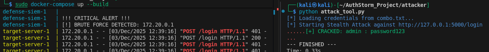

# AuthStorm: Dockerized Purple Team Lab 🌩️


## 🚀 Project Overview
**AuthStorm** is a containerized security engineering lab that simulates the complete lifecycle of an identity-based cyber attack. It demonstrates **DevSecOps** principles by orchestrating a vulnerable infrastructure, an asynchronous adversary engine, and a behavioral detection SIEM within a microservices architecture.

Unlike static scripts, AuthStorm runs as a live ecosystem where offensive actions immediately trigger defensive telemetry, simulating a real-world **Purple Team** environment.

**Target Roles:** Security Engineer, SOC Analyst, DevSecOps.

---

## 🛠️ System Architecture

The lab utilizes a **Shared Volume** architecture to simulate log forwarding within a private Docker network.

```text
+-----------------------------------------------------------------------+
|                     PRIVATE DOCKER NETWORK (172.20.x.x)               |
|                                                                       |
|   +--------------+           +--------------+                         |
|   |   ATTACKER   |           |    TARGET    |                         |
|   |    ENGINE    |---------->|    SERVER    |                         |
|   | (Async Python)| HTTP POST |    (Flask)   |                        |
|   +--------------+           +-------+------+                         |
|                                      |                                |
|                                      | Writes JSON Logs               |
|                                      v                                |
|                              +-------+------+       +--------------+  |
|                              |    SHARED    |<------|     SIEM     |  |
|                              |    VOLUME    | Reads |   DEFENSE    |  |
|                              | (access.log) |       | (Log Analyze)|  |
|                              +--------------+       +-------+------+  |
|                                                             |         |
+-------------------------------------------------------------|---------+
                                                              |
                                                      !!! CRITICAL !!!
                                                      !!!   ALERT  !!!
                                                      (Console Output)
```

### Microservices Breakdown
1.  **Target Server (Flask):** A vulnerable Identity Provider (IdP). It generates **Enterprise-grade JSON structured logs** instead of standard text, ensuring machine-readability for the SIEM.
2.  **The Adversary (Python AsyncIO):** A high-concurrency attack engine. It utilizes `aiohttp` to perform credential stuffing at **80+ requests/second**, implementing **User-Agent rotation** to bypass static signature detection.
3.  **The Defense (SIEM):** A custom log analysis engine. It monitors the shared volume in real-time using a **Sliding Window Algorithm** to detect volumetric anomalies (brute force) and trigger alerts.

### Section 4: Proof of Concept
*This is the visual evidence. Ensure the filename matches exactly what is in your folder.*

## 📸 Proof of Concept

Below is the SIEM log showing the detection of the brute force attack. Note the internal Docker IP (`172.20.0.1`), proving the attack originated from within the containerized network.



---

## ⚡ Quick Start

**Prerequisites:** Docker & Docker Compose.

### 1. Launch the Infrastructure
Start the Target Server and the SIEM Defense engine. The SIEM will enter a "Wait" state until the server is live (Race Condition handling).
```bash
sudo docker-compose up --build
```

Output: You will see the SIEM initialize and display: [*] Log file found! Monitoring started.

### 2. Execute the Attack
Open a new terminal window and launch the offensive engine.

```bash
cd attacker
python attack_tool.py
```

### 3. Verify the Defense
Return to the first terminal. You will see the SIEM detect the traffic spike and trigger a CRITICAL ALERT identifying the attacker's IP.

### 4. Shutdown
To stop the lab and clean up containers/networks:

```bash
sudo docker-compose down
```

## 🧠 Technical Deep Dive

### 1. Asynchronous Offense (The "Engine")
Standard Python scripts use blocking I/O, which is too slow for stress testing. AuthStorm uses `asyncio` and `aiohttp` to create an **Event Loop**.
*   **Semaphore Control:** Implemented a concurrency limit to prevent accidental DoS (Denial of Service) of the host machine.
*   **Evasion:** Randomizes HTTP Headers per request to mimic legitimate distributed traffic.

### 2. Behavioral Defense (The "Shield")
The SIEM does not rely on simple counters. It implements a **Time-Based Sliding Window**:
*   It tracks failed logins per IP address.
*   It automatically expires failures older than `TIME_WINDOW` (10 seconds).
*   **Logic:** `If (Failed_Attempts > Threshold) AND (Time_Span < 10s) -> ALERT`.
*   This reduces false positives from users who simply forgot their password once.

### 3. Infrastructure as Code (The "Lab")
*   **Docker Compose:** Orchestrates the networking and volume binding.
*   **Environment Variables:** Python scripts dynamically adapt to their environment (Localhost vs. Docker) by checking `os.getenv("LOG_PATH")`.

---

## 📂 Project Structure
```text
AuthStorm/
├── attacker/
│   ├── attack_tool.py    # AsyncIO Offensive Engine
│   └── combo.txt         # Credential list
├── defense/
│   ├── Dockerfile        # SIEM Container config
│   └── log_analyzer.py   # Behavioral Detection Logic
├── target/
│   ├── Dockerfile        # Server Container config
│   └── server.py         # Vulnerable Flask App (JSON Logging)
├── docker-compose.yml    # Orchestration
└── requirements.txt      # Python Dependencies
```

## ⚠️ Ethical Disclaimer
This project was built in a controlled, isolated environment (Localhost/Docker) for educational purposes. It is designed to help security professionals understand how attacks are performed and, more importantly, how to detect them. **Do not use these tools on systems you do not own.**